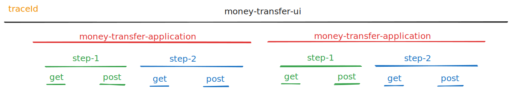
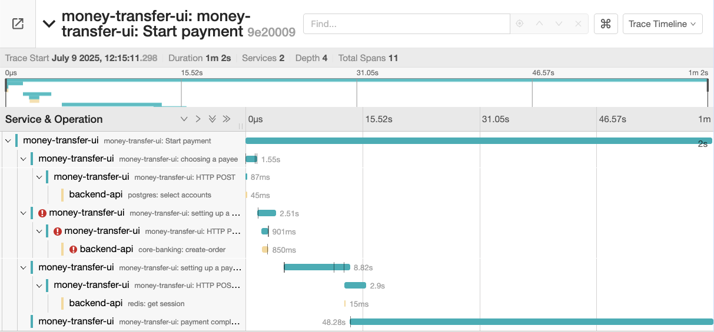
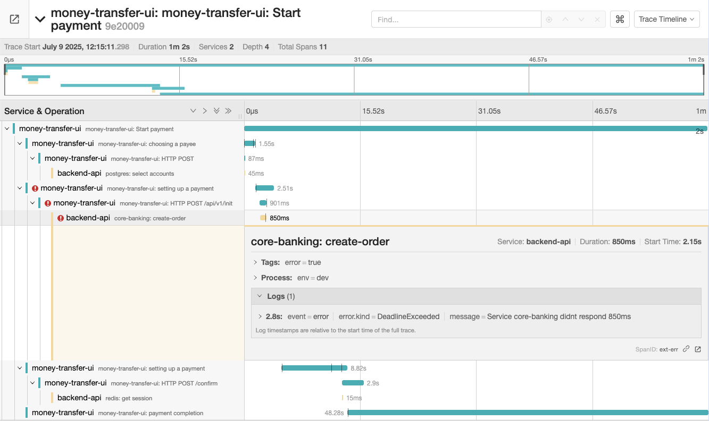

**TL;DR:** This article shares our hands-on experience implementing OpenTelemetry in a massive fintech ecosystem.
**Problem:** Contextless logs make pinpointing the root cause of 500 errors in distributed systems a nightmare.
**Solution:** End-to-end distributed tracing, tracking requests seamlessly from frontend clicks to backend services.
**What’s inside:** A TypeScript implementation of a `CompositeLogger`, a practical guide to patching `fetch` for context propagation, and real-world examples of turning raw technical traces into readable business process maps. We’ll focus specifically on the frontend architecture and integration challenges.

## The Goal: Beyond Standard Logging

In a large-scale application, users trigger dozens of complex, multi-step workflows daily. Traditional logging falls short here because individual log entries lack shared context. Connecting the dots to reconstruct a sequence of events across a distributed architecture with multiple backends can quickly turn into debugging hell.

That’s where OpenTelemetry comes in. As an industry standard with a robust SDK, it allows us to inject structured context directly into our telemetry data. While we already had a basic monitoring setup, it was too primitive to handle advanced correlation.

We needed a way to trace entire business processes from start to finish. Take a look at this typical workflow:

A web module hosts a money transfer form. A user might open and submit this form multiple times during a single session. The form itself consists of several steps, each triggering a flurry of API requests to our backend services.



Our goal was to trace the entire money transfer lifecycle—and ideally, the user’s whole session within the `money-transfer-ui` micro-frontend. By capturing this data, we could filter logs by session or flow and instantly see exactly what went wrong.

Implementing these tools has been a game-changer for incident response, **cutting our root-cause analysis time for specific user journeys by more than 10x.**

> **A quick note on security:** Always obfuscate PII and sensitive financial data. Never let it slip into your logs—on either the frontend or the backend.

## OpenTelemetry

At its core, OpenTelemetry (OTel) is a vendor-neutral protocol defining how observability data should be formatted. It also provides the API, SDK, and a Collector agent to forward metrics and traces to your storage backend of choice (Jaeger, Prometheus, Kibana, Grafana, etc.).

If you want a deep dive into the specs, check out the [official OpenTelemetry documentation](https://opentelemetry.io/docs/concepts/observability-primer/).

For this article, we only need to align on four foundational concepts:

- **Trace:** The overarching tree structure that groups related operations. It is identified by a unique `traceId`.
- **Span:** A single unit of work with a defined start and end time. Spans can be nested inside other spans, creating a clear hierarchy of operations.
- **Event:** A structured timestamped snapshot within a span (essentially an inline log entry) that can carry its own attributes.
- **Attribute:** A key-value pair attached to spans or events, crucial for querying and filtering your data later.

## The Architecture

### System Overview

Let’s look at how a production-ready OpenTelemetry setup operates under the hood:

- The frontend SPA communicates with user-facing product backend services via HTTP APIs.
- Our core platform backend is isolated from the frontend; it handles internal data orchestration and communicates asynchronously via Kafka.
- To keep our infrastructure secure, the frontend doesn't talk to the OTel Collector directly. Instead, it pipes traces through an **Audit Microservice** that proxies traffic, keeping our Collector URLs hidden.
- All backend services natively emit traces, metrics, and logs to the central Collector.
- The **Collector** aggregates this data, routing traces to Jaeger, metrics to Prometheus, and logs to Kibana, with Grafana tying it all together into unified dashboards.



This setup allows us to centralize observability data safely, and more importantly, let us roll out telemetry progressively across dozens of microservices and micro-frontends without breaking existing flows.

### Frontend Architecture

_(Feel free to skip straight to the implementation if you're not focusing on frontend architecture right now.)_

We started by defining a clean abstraction. The centerpiece of our client-side solution is the `Logger` interface. This lets us swap or run multiple logging engines (like Sentry or internal audit tools) alongside OpenTelemetry.

```ts
/**
 * Core Logger interface supporting contextual messages and error tracking.
 */
export interface Logger {
  readonly name: string;
  /**
   * Optional initialization logic for external logging services.
   */
  init?(
    options?: CompositeInitOptions | SentryInitOptions | AuditInitOptions,
  ): void;

  /**
   * Logs an error with optional contextual metadata.
   */
  logError(error: Error, context?: ErrorContextType | ErrorContextType[]): void;

  /**
   * Logs a general message with custom attributes.
   */
  logMessage?(message: string, context?: Record<string, unknown>): void;
}
```

To coordinate our logging tools, we implemented a CompositeLogger using the Composite pattern. It acts as a single orchestrator that passes events to all underlying active loggers.

Using a CompositeLogger gave us three massive advantages:

It decouples implementation details from product developers.

It makes adding or removing logging systems incredibly straightforward.

It completely eliminates friction for feature teams.

If a new monitoring tool comes along, we write a quick wrapper implementing the Logger interface and plug it into the composite layer. Product teams don't have to change a single line of feature code—they just bump our internal npm package version.

Here is a streamlined version of the CompositeLogger class:

```ts
export class CompositeLogger implements Logger {
  public readonly name = "composite";

  constructor(private readonly loggers: Logger[]) {}

  init(options?: CompositeInitOptions): void {
    this.loggers.forEach((logger) => {
      logger.init?.(options?.[logger.name as keyof CompositeInitOptions]);
    });
  }

  logError(error: Error, context?: ErrorContextType[]): void {
    this.loggers.forEach((logger) => {
      logger.logError(error, context);
    });
  }

  logMessage(message: string, context?: Record<string, unknown>): void {
    this.loggers.forEach((logger) => {
      logger.logMessage?.(message, context);
    });
  }

  startBusinessProcess(name: string, attributes?: Attributes): void {
    this.loggers.forEach((logger) => {
      if (logger.name === "otlp") {
        (logger as OtlpLogger).startBusinessProcess(name, attributes);
      }
    });
  }

  addEvent(name: string, attributes?: Attributes): void {
    this.loggers.forEach((logger) => {
      if (logger.name === "otlp") {
        (logger as OtlpLogger).addEvent(name, attributes);
      }
    });
  }
}
```

To make this easily accessible across our React component tree, we wrap it in a standard context provider and hook helper:

```tsx
import React, { createContext, useContext } from "react";
import { CompositeLogger } from "./composite-logger";

const LoggerContext = createContext<CompositeLogger | null>(null);

export const LoggerProvider: React.FC<{
  logger: CompositeLogger;
  children: React.ReactNode;
}> = ({ logger, children }) => (
  <LoggerContext.Provider value={logger}>{children}</LoggerContext.Provider>
);

export const useLogger = (): CompositeLogger => {
  const logger = useContext(LoggerContext);

  if (!logger) {
    throw new Error("Logger not found in context");
  }

  return logger;
};
```

## OpenTelemetry logger

Now let’s look at the actual OpenTelemetry implementation of our `Logger` interface.

This class bootstraps the OTel SDK, hooks into the global `fetch` API, manages active business spans, and logs exceptions.

Why patch `fetch`? By default, the OpenTelemetry SDK creates a brand-new independent trace for every single network request. We needed our API requests to be child spans of the currently active UI workflow instead.

Maintaining context across asynchronous tasks in the browser is notoriously tricky. To solve this, we rely on `StackContextManager`. It’s lightweight, browser-friendly, and automatically attaches child operations (like network `fetch`) to the active business span without forcing developers to pass context references manually through every single function.

```ts
export class OtlpLogger implements Logger {
  public readonly name = "otlp";

  private tracer?: Tracer;
  private provider?: WebTracerProvider;
  private activeSpan?: Span;

  async init(options?: OtlpInitOptions): Promise<void> {
    const provider = new WebTracerProvider({
      sampler: new TraceIdRatioBasedSampler(options?.sampleRatio ?? 1),
    });

    provider.addSpanProcessor(
      new BatchSpanProcessor(new OTLPTraceExporter({ url: options?.otlpUrl })),
    );

    provider.register({
      contextManager: new StackContextManager(),
      propagator: new B3Propagator(),
    });

    this.tracer = trace.getTracer(options?.serviceName || "frontend");
    this.provider = provider;

    this.patchFetch();
  }

  startBusinessProcess(name: string, attributes?: Attributes) {
    if (!this.tracer) return;

    this.activeSpan = this.tracer.startSpan(name, { attributes });
  }

  addEvent(name: string, attributes?: Attributes) {
    this.activeSpan?.addEvent(name, attributes);
  }

  logError(error: Error) {
    this.activeSpan?.recordException(error);
  }

  private patchFetch() {
    const originalFetch = window.fetch;

    window.fetch = async (...args) => {
      return context.with(context.active(), () => originalFetch(...args));
    };
  }
}
```

The magic happens inside `patchFetch`. By wrapping the original `fetch` invocation in `context.with(context.active(), ...)`, we force OpenTelemetry to recognize the network call as a direct descendant of our active UI workflow.

## Real-World Usage: Instrumenting React Routes

Let’s see how this looks in practice inside a multi-step money transfer flow. Our module handles routing across several distinct steps (`/`, `/step-1`, `/step-2`, `/step-3`).

We want to know exactly which step fails or causes a user to drop off. By hooking into the router's lifecycle, we can automatically manage our tracing boundaries:

```jsx
// Base dependencies
import { useEffect } from "react";
import { Routes, Route, useLocation } from "react-router-dom";

// Import pages
import { TransferPage } from "client/view/transefer-page";
import { FinalPage } from "client/view/final-page";
import { ContactPage } from "client/view/contact-page";

// Our logger package
import { useLogger } from "@my-org/logger";

// Constants moved to separate file
import { OTLP_BUISENESS_PROCESS_STEP_NAMES } from "client/system/otlp-logger-utils/constants";

export const AppRoutes = () => {
  const logger = useLogger();
  const location = useLocation();

  useEffect(() => {
    switch (location.pathname) {
      case "/":

      case "/step-1":
        logger.startBusinessProcessStep(
          OTLP_BUISENESS_PROCESS_STEP_NAMES.CHOOSING_A_PAYEE,
        );
        break;

      case "/step-2":
        logger.startBusinessProcessStep(
          OTLP_BUISENESS_PROCESS_STEP_NAMES.SETTING_UP_A_PAYMENT,
        );
        break;

      case "/step-3":
        logger.startBusinessProcessStep(
          OTLP_BUISENESS_PROCESS_STEP_NAMES.PAYMENT_COMPLETION,
        );
        break;

      default:
        break;
    }

    return () => {
      if (location.pathname === "/step-3") {
        logger.endBusinessProcess();
      }

      logger.endBusinessProcessStep();
    };
  }, [location]);

  return (
    <Routes>
      <Route path="/" element={<ContactPage />} />
      <Route path="/step-1" element={<ContactPage />} />
      <Route path="/step-2" element={<TransferPage />} />
      <Route path="/step-3" element={<FinalPage />} />
    </Routes>
  );
};
```

## Reading the Traces: From UI Clicks to Backend Timeouts

_(Note: The following traces are mock representations to respect NDA boundaries, but they accurately reflect production telemetry data)_

Once your routes and network layers are instrumented, you get access to crystal-clear visual timelines. In this example, we can see a user traversing the `Payment` flow: `choosing a payee`, `setting up a recipient`, `setting up a payment`, and finally reaching `payment completed`.

However, the timeline reveals a glaring bug: an error occurs during the second step, but the UI fails to halt the user, mistakenly allowing them to move forward.



But here is where OpenTelemetry truly shines. Instead of guessing why step two failed, we can click into the trace and see the **exact root cause on the backend**:



Thanks to distributed context propagation (`traceId`), the frontend **error matches** perfectly with our backend spans. We can instantly see that the backend threw an exception because a downstream integration timed out.

In a highly microservice-oriented environment, these `traceId` and `spanId` tokens can be passed along even further—into Kafka queues, third-party vendor integrations, or internal services—giving you unparalleled visibility into your stack.

## Known limitations

While OpenTelemetry is rapidly becoming the gold standard for backend distributed tracing, using it on the frontend comes with distinct tradeoffs:

- Backend-First Design: OpenTelemetry was originally built for servers. Adapting it to client-side lifecycles can feel clunky when you step outside basic documentation examples.
- Bundle Size Impact: The full OTel SDK is heavy. If bundle size is a critical KPI for your team, you will need to invest time into dynamic code-splitting and lazy-loading telemetry chunks asynchronously.
- Session-Level Tracking Quirks: If you want to map an entire user session to a single trace span (like we did), you will hit edge cases. Tracking a clean "session end" event in a browser or web-view is notoriously unreliable. Relying on onbeforeunload or sendBeacon helps, but it’s rarely 100% foolproof.

## Заключение

People often ask: "Why use OpenTelemetry when we already have Sentry?" In our ecosystem, they solve completely different problems. We use Sentry to catch technical client-side errors, track Core Web Vitals, and monitor UI health. We use OpenTelemetry to map business logic and trace journeys across our entire infrastructure.

Should every project drop everything and adopt OpenTelemetry? Absolutely not. If you are managing a monolith or a straightforward setup with just a few dozen services, structured logs are more than enough. But if you are wrangling a massive, rapidly evolving microservice ecosystem and need an industrial-grade way to map critical business workflows, OpenTelemetry is well worth the investment.
